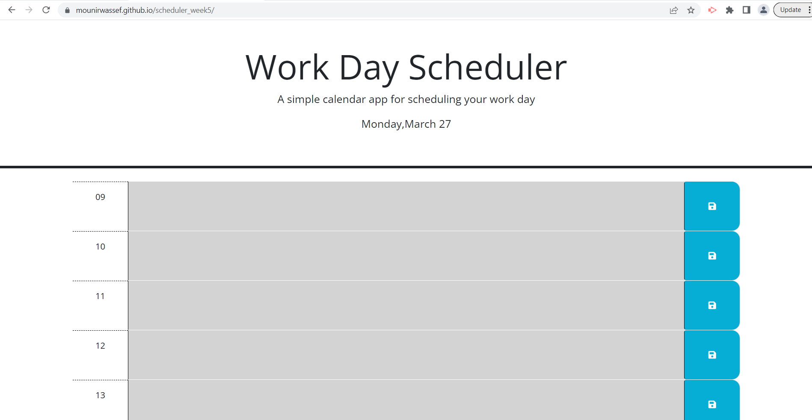

# scheduler_week5
this is the 5th assignment

# About
this project is about work scheduler which shows the provious , current , and future hours in diffrent colors and when you save a text and refresh the page it will stay displayed.

# tools
used java scrips comands we learned in Bootcamp class plues google and youtube 

# page url
https://mounirwassef.github.io/scheduler_week5/

# screan shot 
below purview
